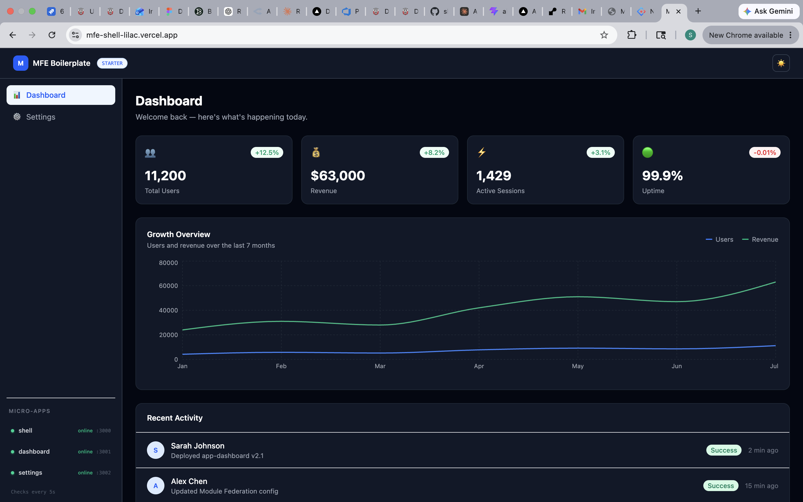
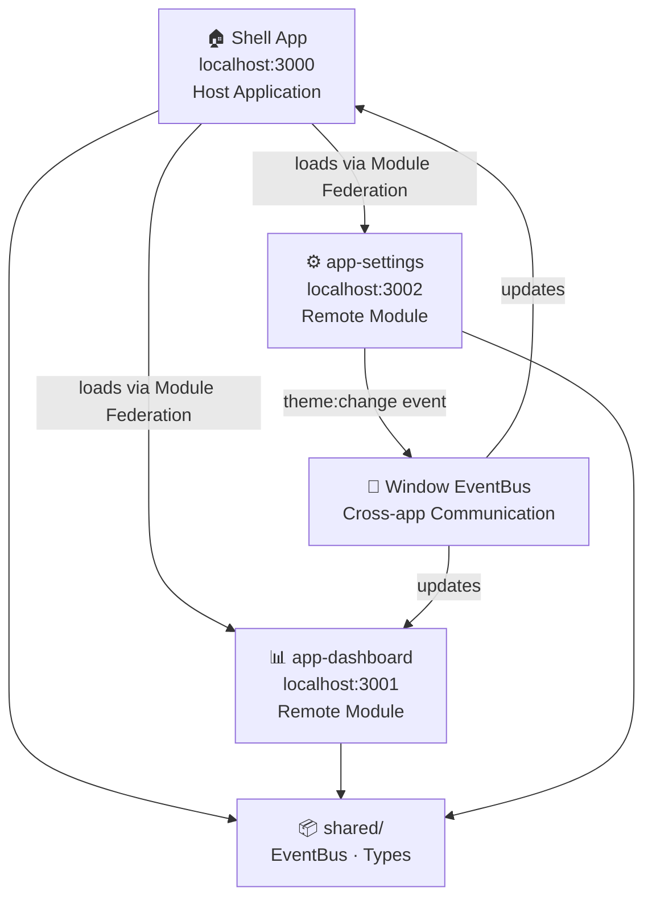

# MFE Boilerplate Starter

A production-ready **Micro-Frontend Architecture** starter kit built with **Webpack 5 Module Federation**, React 18, and TypeScript. Demonstrates independently deployable micro-apps with shared dependencies, cross-app communication, and a real-time health monitoring system.

---

## Live Demo

| App | URL |
|-----|-----|
| Shell | https://mfe-shell-lilac.vercel.app |
| Dashboard | https://mfe-dashboard-tan.vercel.app |
| Settings | https://mfe-settings-iota.vercel.app |

---

## Preview



## Architecture Overview



---

## Features

- **Micro-Frontend Architecture** using Webpack 5 Module Federation
- **Independent deployability** — each app builds and runs on its own
- **Cross-app communication** via `window` CustomEvents (no shared state)
- **Dark mode** persisted in `localStorage`, synced across all micro-apps
- **Real-time health monitoring** — sidebar polls each remote every 5 seconds
- **Page transition animations** using Framer Motion
- **Animated stat counters** with custom `useCountUp` hook
- **Error boundaries** with fallback UI for failed remote loads
- **GitHub Actions CI** — type check and build validation on every push
- **TypeScript** throughout all apps

---

## Tech Stack

| Layer | Technology |
|-------|------------|
| Framework | React 18 + TypeScript |
| Module Federation | Webpack 5 + @module-federation/enhanced |
| Styling | Tailwind CSS v4 |
| Animations | Framer Motion |
| Charts | Recharts |
| UI Components | Ant Design |
| CI/CD | GitHub Actions |
| Deployment | Vercel |

---

## Project Structure

```
mfe-boilerplate/
├── shell/                  # Host app — routing, navbar, sidebar
│   ├── src/
│   │   ├── components/     # Navbar, Sidebar, ErrorBoundary
│   │   ├── pages/          # DashboardPage, SettingsPage
│   │   ├── utils/          # eventBus
│   │   └── declarations.d.ts
│   └── webpack.config.js
│
├── app-dashboard/          # Remote micro-app — stats, chart, activity
│   ├── src/
│   │   ├── hooks/          # useCountUp
│   │   └── utils/          # eventBus
│   └── webpack.config.js
│
├── app-settings/           # Remote micro-app — profile, theme, notifications
│   ├── src/
│   │   └── utils/          # eventBus
│   └── webpack.config.js
│
├── shared/                 # Shared types and utilities
│   └── src/
│       ├── types/          # MicroApp, Theme, EventCallback
│       └── utils/          # eventBus (source of truth)
│
└── .github/
    └── workflows/
        └── ci.yml          # GitHub Actions CI pipeline
```

---

## How Module Federation Works Here

The Shell is configured as the **host** — it declares which remotes to load:

```js
// shell/webpack.config.js
new ModuleFederationPlugin({
  name: "shell",
  remotes: {
    appDashboard: "appDashboard@http://localhost:3001/remoteEntry.js",
    appSettings:  "appSettings@http://localhost:3002/remoteEntry.js",
  },
  shared: { react: { singleton: true }, "react-dom": { singleton: true } }
})
```

Each micro-app is configured as a **remote** — it exposes its components:

```js
// app-dashboard/webpack.config.js
new ModuleFederationPlugin({
  name: "appDashboard",
  filename: "remoteEntry.js",
  exposes: {
    "./Dashboard": "./src/App",
  },
  shared: { react: { singleton: true }, "react-dom": { singleton: true } }
})
```

The Shell then loads the Dashboard lazily at runtime:

```tsx
const Dashboard = lazy(() => import("appDashboard/Dashboard"));
```

---

## Cross-App Communication

Instead of shared global state, this project uses the browser's native `CustomEvent` API — all micro-apps share the same `window` object:

```ts
// Emit from Settings
window.dispatchEvent(new CustomEvent("theme:change", { detail: "dark" }));

// Listen in Dashboard
window.addEventListener("theme:change", (e) => {
  const theme = (e as CustomEvent).detail;
  setIsDark(theme === "dark");
});
```

This pattern allows truly decoupled micro-apps with zero shared runtime dependencies.

---

## Getting Started

### Prerequisites
- Node.js 20+
- npm 9+

### Installation

```bash
# Clone the repo
git clone https://github.com/shubhamrathi-er/mfe-boilerplate.git
cd mfe-boilerplate

# Install root dependencies
npm install

# Install dependencies for each app
cd shell && npm install && cd ..
cd app-dashboard && npm install && cd ..
cd app-settings && npm install && cd ..
```

### Running Locally

Open three terminals:

```bash
# Terminal 1 — Shell (http://localhost:3000)
cd shell && npm run start

# Terminal 2 — Dashboard (http://localhost:3001)
cd app-dashboard && npm run start

# Terminal 3 — Settings (http://localhost:3002)
cd app-settings && npm run start
```

Visit **http://localhost:3000**

### Adding a New Micro-App

1. Create a new folder (e.g. `app-analytics/`)
2. Set up webpack config as a remote on a new port (e.g. `3003`)
3. Expose your component: `exposes: { "./Analytics": "./src/App" }`
4. Add the remote to shell's webpack config
5. Add a type declaration in `shell/src/declarations.d.ts`
6. Create a new page in `shell/src/pages/`
7. Add a route and sidebar link in shell

---

## CI/CD

GitHub Actions runs automatically on every push to `main` and every Pull Request:

- ✅ TypeScript type check (`tsc --noEmit`)
- ✅ Production build (`webpack --mode production`)
- Runs in parallel for all three apps

---

## Author

**Shubham Rathi** — Senior Frontend Engineer  
[LinkedIn](https://linkedin.com/in/shubham-rathi-7480891aa) · [GitHub](https://github.com/shubhamrathi-er)